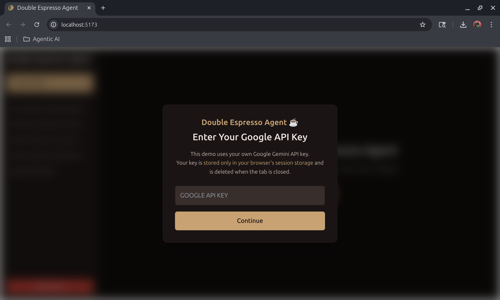

# **Double Espresso Agent**

## **Problem Statement**

Learning through LLMs is meaningful only when users can stay focused on the core discussion, but in practice, conversations become bloated very quickly. Whenever an LLM introduces an unfamiliar term or concept, users naturally ask clarifying questions. These clarifications are rarely the main topic, yet they expand the chat thread dramatically and force the user to scroll repeatedly to relocate the original point. Over time, this creates friction that interrupts learning, breaks concentration, and often leads to abandoning the conversation altogether. Curiosity rarely follows a straight line; it branches. However, the traditional chat interface forces everything into a single vertical scroll, creating mental clutter and unnecessary navigation overhead. This issue affects anyone who uses LLMs as a study companion or research assistant, especially for complex subjects that require multiple layers of explanation which should not coexist in the same linear discussion.

## **Solution Statement**

Double Espresso Agent introduces a branching conversation experience that aligns with the natural flow of curiosity. Instead of forcing all follow-up questions into the main discussion, the user can fork the conversation at any moment and open a secondary chat panel dedicated entirely to auxiliary questions. This secondary thread inherits the context up to the point of forking, enabling the user to dive deeper into confusing terms, explore subtopics, or request step-by-step clarifications without inflating the primary discussion. The main chat remains concise and readable, while the secondary chat becomes a structured space for side explorations that remain persistent and accessible. Built on Google ADK’s multi-agent architecture, the system maintains consistency across both threads, keeps each agent context-aware, and provides a more organized, efficient, and cognitively lightweight learning experience.

---

# **Technical Architecture**


Double Espresso Agent is implemented as a two-layer system: a backend centered around Google ADK and persistent session storage, and a minimal React frontend that communicates via HTTP REST. The emphasis of the project is on the backend, where the orchestration, session management, and multi-agent logic reside.

The application is built using **Python 3.12**, **FastAPI**, **SQLAlchemy 2.0**, and **google-adk 0.3**. The system uses two persistent databases: `chat.db` for application-level chat and message storage, and `adk_sessions.db` for all ADK-managed session transcripts.

---

## **Multi-Agent Design**

Two agents are defined in `agents.py`:

### **Primary Agent**

A general conversational assistant with concise, structured response behavior. It handles the main linear conversation.

### **Secondary Agent**

A clarification-focused agent that activates whenever the user forks a message. It receives the parent message explicitly as contextual input, ensuring that explanations remain anchored to that specific point rather than the broader conversation.

Both agents use **Gemini 2.0 Flash** and are orchestrated through ADK runners.

---

## **ADK Session Management**

Core orchestration is implemented in `session_manager.py`, which handles:

* Creating new ADK sessions for primary or secondary chats
* Long-term session persistence via `DatabaseSessionService`
* Temporary per-request API key injection
* LLM execution through ADK’s event-streaming system
* Extracting final messages from streamed ADK events
* Session rehydration across user messages

Each chat entry stores an associated ADK session ID, ensuring deterministic continuation and stable conversation memory.

---

## **Database Schema**

SQLAlchemy models in `models.py` and Pydantic schemas in `schemas.py` define:

### **Chat Model**

Stores chat type (primary/secondary), parent references, and ADK session linkage.

### **Message Model**

Stores each message with role, content, and timestamp.

A uniqueness constraint ensures only one secondary chat is created per parent message.

---

## **Observability**

Instrumentation includes:

* Complete logging of ADK event flow
* Metrics counters such as `agent.calls`, `agent.calls.primary`, and `agent.calls.secondary`
* Timing and event sequence visibility for debugging and performance analysis

These metrics are used to monitor both agent behavior and system health.

---

# **Frontend Overview**

The frontend (React + Vite + Tailwind) communicates exclusively through REST.
The main logic resides in `useChatManager.js`, responsible for:

* Loading chats
* Sending messages
* Forking secondary chats
* Simulating streaming responses

All API interactions are defined in `api/chats.js`, which attaches the user’s Google API Key to each request.

---

# **Future Features**

* Automatic context transfer from secondary chats back to the primary thread
* Intelligent suggestions for when to fork a conversation
* Multimodal branches such as image-based or diagram-specific side threads

---

# **Running the Application Locally**

This guide explains how to run the Double Espresso Agent locally using FastAPI for the backend and React + Vite for the frontend.

---

## **1. Prerequisites**

* Python 3.12+
* Node.js 18+
* npm or yarn
* Google API Key (Gemini)
* pip / virtual environment
* SQLite (included with Python)

---

## **2. Backend Setup (FastAPI + Google ADK)**

### **Step 1 — Create and activate a virtual environment**

```bash
cd backend
python3 -m venv venv
source venv/bin/activate     # Linux/Mac
venv\Scripts\activate        # Windows
```

### **Step 2 — Install dependencies**

```bash
pip install -r requirements.txt
```

### **Step 3 — Create a `.env` file inside `backend/`**

```env
GOOGLE_API_KEY=your_api_key_here
DATABASE_URL=sqlite:///./chat.db
ADK_SESSION_DB_URL=sqlite:///./adk_sessions.db
```

### **Step 4 — Initialize the database**

```bash
python -c "from app.db.models_init import init_db; init_db()"
```

### **Step 5 — Start the FastAPI server**

```bash
uvicorn app.main:app --reload --port 8000
```

Backend runs at:

```
http://127.0.0.1:8000
```

API docs:

```
http://127.0.0.1:8000/docs
```

---

## **3. Frontend Setup (React + Vite)**

### **Install dependencies**

```bash
cd frontend
npm install
```

### **Start the frontend**

```bash
npm run dev
```

Frontend opens at:

```
http://127.0.0.1:5173
```

---

## **4. Providing Your Google API Key**

The frontend will prompt you to enter your Gemini API Key.

